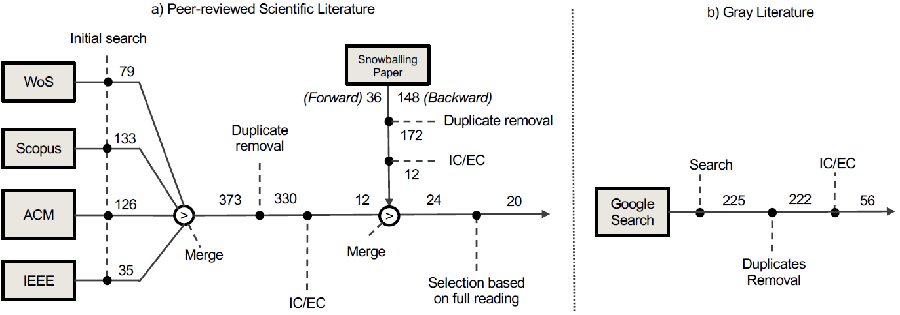

# Replication Package for the paper "Barriers and Enablers for Traceability and Federation in Model-Based Digital Twin Engineering"

This repository accompanies the paper “**Barriers and Enablers for Traceability and Federation in Model-Based Digital-Twin Engineering**”, submitted to the "
Information and Software Technology" Journal, special issue on "Model- and Data-driven Digital Twins".
 
It contains every artefact needed to reproduce the **Multi-Vocal Literature Review (MLR)**, the **industry survey**, and all data-analysis pipelines.

  
   
  <em>Figure 1 – End-to-end protocol followed in the study</em>

<figure>
  
  <figcaption>Figure 1 – End-to-end protocol followed in the study</figcaption>
</figure>

  
   
  <em>Figure 2 – Search-and-selection workflow numbers</em>

---

## Repository layout

| Path | What you will find |
| ---- | ------------------ |
| `MLR/` | Everything related to the literature study (protocol, data-extraction sheets, analysis notebooks, tool mapping). |
| `Survey/` | Raw questions, anonymous answers, and aggregated results of the expert survey. |
| `img/` | Figures referenced in the paper &amp; in this README. |
| `Definitions.xlsx` | Glossary of terms and controlled vocabulary used across the project. |

> **Tip:** every sub-folder includes its own `README.md` for deeper guidance.

